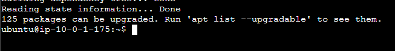
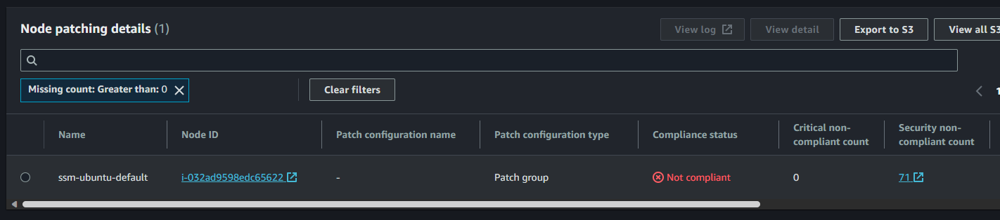
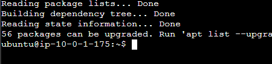
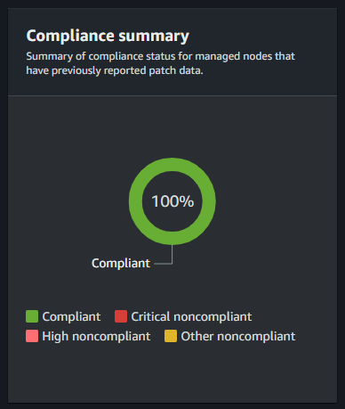
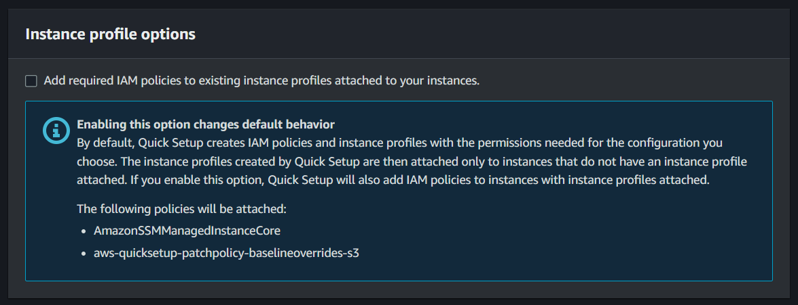
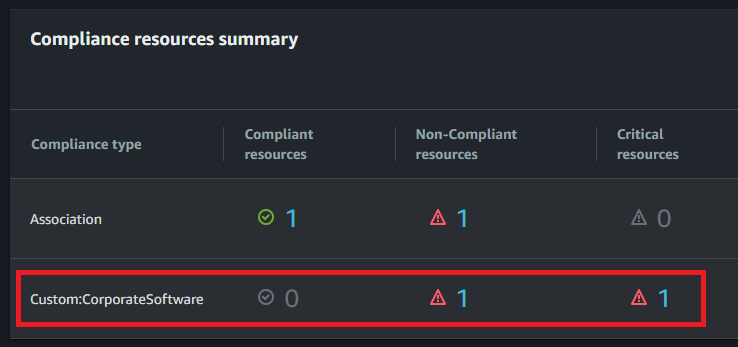

#  AWS Systems Manager

Short reference implementation for key capabilities of Systems Manager components:

| Icon | SSM Feature     | Example scenarios |
|-| ----------------|---------|
| | Automation      | Controlling the state (start, stop, restart) EC2 instances. |
|  | Run Command     | 1. Find and apply Windows updates. <br/> 2. Update SSH authorized keys on Linux machines.  |
|  | Inventory       | Dashboard with in-depth information collected about the fleet |
|  | Patch Manager   | Scan and install security patches. |
|  | Compliance      | Compliance items registered for instances.|
|  | State Manager |  Document associations with instances. |
|  | Distributor |  Install the CloudWatch Agent package. |


##  Instances setup

Start by copying the `.auto.tfvars` file template:

> 💡 The sample config AMIs already include the SSM Agent

```sh
cp samples/sample.tfvars .auto.tfvars
```

Generate a temporary key pair:

```sh
mkdir keys
ssh-keygen -f keys/temp_key
```

Create the sandbox infrastructure:

```sh
terraform init
terraform apply -auto-approve
```

Enter the Systems Manager console and check the Fleet Manager blade.

If you prefer using Session Manager with the CLI:

```sh
aws ssm start-session \
    --target instance-id
```

Check if the instance components have been installed:

```sh
cloud-init status

sudo /opt/aws/amazon-cloudwatch-agent/bin/amazon-cloudwatch-agent-ctl -m ec2 -a status
```

##  Automation

### Starting & stopping instances

To stop an instance using Automation, use a shared Document:

```sh
aws ssm start-automation-execution \
    --document-name "AWS-StopEC2Instance" \
    --parameters "InstanceId=i-00000000000000000"
```

To start the instance again:

```sh
aws ssm start-automation-execution \
    --document-name "AWS-StartEC2Instance" \
    --parameters "InstanceId=i-00000000000000000"
```

Restart is also an option:

```sh
aws ssm start-automation-execution \
    --document-name "AWS-RestartEC2Instance" \
    --parameters "InstanceId=i-00000000000000000"
```

##  Run Command

### Windows Updates

Use the document `AWS-FindWindowsUpdates` to find updates for Windows:

```sh
aws ssm send-command \
    --document-name "AWS-FindWindowsUpdates" \
    --parameters "UpdateLevel=All" \
    --targets Key=tag:Environment,Values=Development Key=tag:Platform,Values=Windows
```

Check the console for status and execution output.

You can now use the document `AWS-InstallMissingWindowsUpdates` to install the missing Windows updates:

```sh
aws ssm send-command \
    --document-name "AWS-InstallMissingWindowsUpdates" \
    --parameters "UpdateLevel=All" \
    --targets Key=tag:Environment,Values=Development Key=tag:Platform,Values=Windows
```

After applying the updates, you can check for missing updates one more time to confirm it all went well.

### Linux - Update SSH authorized keys

Use RunCommand to execute a custom code and edit the `authorized_keys` file.

Test your local connection to an instance:

```sh
ssh -i ./keys/temp_key ubuntu@<publid-ip>
```

Create a **new pair** of keys:

```sh
ssh-keygen -f ./keys/new_temp_key
```

Using `AWS-RunShellScript`, backup the `authorized_keys` file:

```sh
aws ssm send-command \
    --document-name "AWS-RunShellScript" \
    --comment "Backup the key pair" \
    --targets Key=tag:Environment,Values=Development Key=tag:Platform,Values=Linux \
    --parameters "commands='cp /home/ubuntu/.ssh/authorized_keys /tmp/copy_of_authorized_keys'" \
    --output text
```

Now proceed with method of choice for adding or replacing the actual key.

Use a safe method in production. For this test you can do:

```sh
aws ssm send-command \
    --document-name "AWS-RunShellScript" \
    --comment "Backup the key pair" \
    --targets Key=tag:Environment,Values=Development Key=tag:Platform,Values=Linux \
    --parameters "commands='echo PUBLIC_KEY >> /home/ubuntu/.ssh/authorized_keys'" \
    --output text
```

##  Inventory

If you haven't yet, you'll need to [enable inventory][1] to collect data.

When you set up Inventory, a new association `AWS-GatherSoftwareInventory` is created on **State Manager**.


##  Patch Manager

From the documentation:

> Patch Manager, a capability of AWS Systems Manager, automates the process of patching managed nodes with both security-related updates and other types of updates.

Patch Manager can integration with AWS Organizations or a complete management of patches.

As of now, there are four options for `Scan` and `Scan and install` operations:

- Patch Policy (recommended)
- Host Management
- Maintenance window
- On-demand

Patches can be managed in many ways. Let's follow this [walkthrough](https://docs.aws.amazon.com/systems-manager/latest/userguide/patch-manager-cli-commands.html#patch-operations-cli-commands).

To run a simple test, connect to the Linux box and do a `sudo apt update`. There should be packages to upgrade.



Scan the target instance:

```sh
aws ssm send-command \
    --document-name 'AWS-RunPatchBaseline' \
    --targets Key=InstanceIds,Values='i-00000000000000000' \
    --parameters 'Operation=Scan' \
    --timeout-seconds 600
```

Check the operation status:



If you check the output, it will be match the `apt update` from before.

To solve the non-compliance issue, run the patch with the `Install` operation:

```sh
aws ssm send-command \
    --document-name 'AWS-RunPatchBaseline' \
    --targets Key=InstanceIds,Values='i-00000000000000000 ' \
    --parameters 'Operation=Install,RebootOption=RebootIfNeeded' \
    --timeout-seconds 600
```

Make sure you set `--timeout-seconds 600` with a compatible value, updates might take a while to complete.

To ensure availability of your solution, make sure the `RebootOption` matches your use case. The default option is `RebootOption=RebootIfNeeded`.

After the document runs, the non-compliant patches were significantly reduced to a 56 count.



The compliance reports should be all green now:



In can you want to check the status of the agent:

```sh
sudo /opt/aws/amazon-cloudwatch-agent/bin/amazon-cloudwatch-agent-ctl -m ec2 -a status
```

### Auto Scaling Groups (ASG)

There is an ASG resource available in this Terraform configuration. Enable it for testing.

To patch instances in an ASG:

```sh
aws ssm send-command \
    --document-name 'AWS-RunPatchBaseline' \
    --targets Key=tag:Cluster,Values=ASG \
    --parameters 'Operation=Install,RebootOption=RebootIfNeeded' \
    --timeout-seconds 600
```

### Patch Policy

Currently, only the Console supports this via Quick Setup. A good reference for patching is [this article](https://aws.amazon.com/blogs/mt/how-moodys-uses-aws-systems-manager-to-patch-servers-across-multiple-cloud-providers/).

You can schedule a policy using crontab. Example:

```
# Run at 10:00 am (UTC) every day
cron(30 20 * * ? *)
```

If you have issues when deploying stack sets, try deleting [IAM roles and permissions](https://docs.aws.amazon.com/systems-manager/latest/userguide/quick-setup-getting-started.html#quick-setup-getting-started-iam) that are used. You might have to delete the StackSet and it's stale stacks prior to that.

If you run into the ["Invoke-PatchBaselineOperation : Access Denied"](https://docs.aws.amazon.com/systems-manager/latest/userguide/patch-manager-troubleshooting.html#patch-manager-troubleshooting-patch-policy-baseline-overrides) issue, follow the instructions to fix it. For that, you must understand the [bucket permissions](https://docs.aws.amazon.com/systems-manager/latest/userguide/quick-setup-patch-manager.html#patch-policy-s3-bucket-permissions) architecture for this service.

Selecting this option should not generate S3 and tags issues:



To deal with such issues, you can ignore tag changes in Terraform:

```terraform
provider "aws" {
  region = var.aws_region

  ignore_tags {
    key_prefixes = [
      "QSConfigName-",
      "QSConfigId-",
    ]
  }
}
```

And add the following policy to the IAM Instance Profile:

```json
{
  "Version": "2012-10-17",
  "Statement": [
    {
      "Effect": "Allow",
      "Action": "s3:GetObject",
      "Resource": "arn:aws:s3:::aws-quicksetup-patchpolicy-*"
    }
  ]
}
```

### Maintenance Windows

This project creates maintenance windows configurations.

Check it out in the SSM console when deployed.

To know more about the [`No Invocations to Execute`](https://repost.aws/knowledge-center/ssm-no-invocations-automation) message.

> I solved the issue above by associating targets as opposed to instance IDs to my task.


##  Compliance

You can use SSM Compliance to scan your fleet of managed nodes for patch compliance and configuration inconsistencies

To simulate a compliance issue, execute this command to require a custom software that is not installed in your instance:

```sh
aws ssm put-compliance-items \
    --resource-id i-00000000000000000 \
    --resource-type ManagedInstance \
    --compliance-type Custom:CorporateSoftware \
    --execution-summary ExecutionTime=1597815633 \
    --items Id=Version-2.0,Title=CorporateSoftware,Severity=CRITICAL,Status=NON_COMPLIANT \
    --region us-east-2
```

Check your fleet status, and the targeted instance should appear as non-compliant:



##  State Manager

With State Manager it is possible to introduce association between SSM Documents and instances.

Following [this example](https://docs.aws.amazon.com/systems-manager/latest/userguide/sysman-state-cli.html), it is possible to associate the [`AWS-UpdateSSMAgent`](https://docs.aws.amazon.com/systems-manager/latest/userguide/documents-command-ssm-plugin-reference.html#aws-updatessmagent) document on an instance with a schedule.

To follow thorough with this, open a session on your Linux instance and check the SSM [agent version](https://docs.aws.amazon.com/systems-manager/latest/userguide/ssm-agent-get-version.html):

```sh
sudo snap list amazon-ssm-agent
```

It is likely that at least a minor patch needs to be updated.

Create a State Manager association for the instance:

```sh
aws ssm create-association \
	--name "AWS-UpdateSSMAgent" \
	--targets "Key=instanceids,Values=i-00000000000000000"
```

Check the association status, and if it is successful, the agent will be updated in the instance.

One strategy is to associate schedulers and let it update the agents periodically:

```sh
--schedule-expression "cron(0 2 ? * SUN *)"
```

##  Distributor

You can use distributor to install AWS or custom packages.

Here is an example installing the `AmazonCloudWatchAgent` package:

```sh
aws ssm send-command \
    --document-name "AWS-ConfigureAWSPackage" \
    --instance-ids "i-00000000000000000" \
    --parameters '{"action":["Install"],"installationType":["Uninstall and reinstall"],"name":["AmazonCloudWatchAgent"]}'
```

Wait for the command to execute and test the instance:

```sh
amazon-cloudwatch-agent-ctl -help
```

---

### 🧹 Clean Up

```sh
terraform destroy -auto-approve
```

[1]: https://docs.aws.amazon.com/systems-manager/latest/userguide/sysman-inventory-configuring.html
